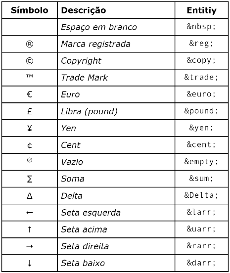

# 🕵️ Observations
* &lt;hr&gt; - The Thematic Break (Horizontal Rule) element
The  &lt;hr&gt; HTML element represents a thematic break between paragraph-level elements: for example, a change of scene in a story, or a shift of topic within a section.
Historically, this has been presented as a horizontal rule or line. While it may still be displayed as a horizontal rule in visual browsers, this element is now defined in semantic terms, rather than presentational terms, so if you wish to draw a horizontal line, you should do so using appropriate CSS.;
<hr>

* Some specials characters:<br>

* &lt;b&gt; - Bold (non-semantic);
* &lt;strong&gt; - Contrast (semantic);
* &lt;i&gt; - Italic (non-semantic);
* &lt;em&gt; - Emphasis - (semantic);
* &lt;mark&gt; - Marked text;
* &lt;big&gt; - Increase font size;
* &lt;small&gt; - Decrease font size;
* &lt;del&gt; - Mark as deleted;
* &lt;ins&gt; - Mark as inserted (semantic);
* &lt;u&gt; - Underlined (non-semantic);
* &lt;sup&gt; - Superscript (X<sup>20</sup>+3);
* &lt;sub&gt; - Subscribed (H<sub>2</sub>O);
* &lt;code&gt; - To make the font style monospaced. Define some text as computer code in a document. The &lt;code&gt; tag is used to define a piece of computer code. The content inside is displayed in the browser's default monospace font. Tip: This tag is not deprecated. However, it is possible to achieve richer effect by using CSS;
* &lt;pre&gt; - To make the text be preformatted being possible change the indentation. The &lt;pre&gt; tag defines preformatted text. Text in a &lt;pre&gt; element is displayed in a fixed-width font, and the text preserves both spaces and line breaks. The text will be displayed exactly as written in the HTML source code;
* &lt;q&gt; - Quotes. Mark up a short quotation. The &lt;q&gt; tag defines a short quotation. Browsers normally insert quotation marks around the quotation. Tip: Use &lt;blockquote&gt; for long quotations.

<hr>

* &lt;blockquote&gt; - A section that is quoted from another source:
```HTML
    <blockquote cite="http://www.worldwildlife.org/who/index.html">
    For 50 years, WWF has been protecting the future of nature. The world's leading conservation organization, WWF works in 100 countries and is supported by 1.2 million members in the United States and close to 5 million globally.
    </blockquote>
```
It results in:
<blockquote cite="http://www.worldwildlife.org/who/index.html">
  For 50 years, WWF has been protecting the future of nature. The world's leading conservation organization, WWF works in 100 countries and is supported by 1.2 million members in the United States and close to 5 million globally.
</blockquote>
<br>
The &lt;blockquote&gt; tag specifies a section that is quoted from another source. Browsers usually indent &lt;blockquote&gt; elements (look at example below to see how to remove the indentation).
<hr>

* &lt;abbr&gt; - An abbreviation is marked up as follows: The <abbr title="World Health Organization">WHO</abbr> was founded in 1948. The &lt;abbr&gt; tag defines an abbreviation or an acronym, like "HTML", "CSS", "Mr.", "Dr.", "ASAP", "ATM". Tip: Use the global title attribute to show the description for the abbreviation/acronym when you mouse over the element.

* &lt;bdo&gt; Specify the text direction:
```HTML
<bdo dir="rtl">
This text will go right-to-left.
</bdo>
```
<bdo dir="rtl">
This text will go right-to-left.
</bdo>

BDO stands for Bi-Directional Override. The &lt;bdo&gt; tag is used to override the current text direction.
<hr>

* The &lt;picture&gt; tag gives web developers more flexibility in specifying image resources.

The most common use of the &lt;picture&gt; element will be for art direction in responsive designs. Instead of having one image that is scaled up or down based on the viewport width, multiple images can be designed to more nicely fill the browser viewport.

The &lt;picture&gt; element contains two tags: one or more &lt;source&gt; tags and one &lt;img&gt; tag.

The browser will look for the first &lt;source&gt; element where the media query matches the current viewport width, and then it will display the proper image (specified in the srcset attribute). The &lt;img&gt; element is required as the last child of the &lt;picture&gt; element, as a fallback option if none of the source tags matches.

Tip: The &lt;picture&gt; element works "similar" to &lt;video&gt; and &lt;audio&gt;. You set up different sources, and the first source that fits the preferences is the one being used.
<hr>

* The &lt;source&gt; tag is used to specify multiple media resources for media elements, such as &lt;video&gt;, &lt;audio&gt;, and &lt;picture&gt;.

The &lt;source&gt; tag allows you to specify alternative video/audio/image files which the browser may choose from, based on browser support or viewport width. The browser will choose the first &lt;source&gt; it supports.